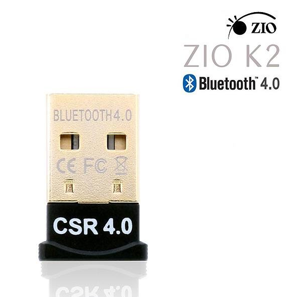
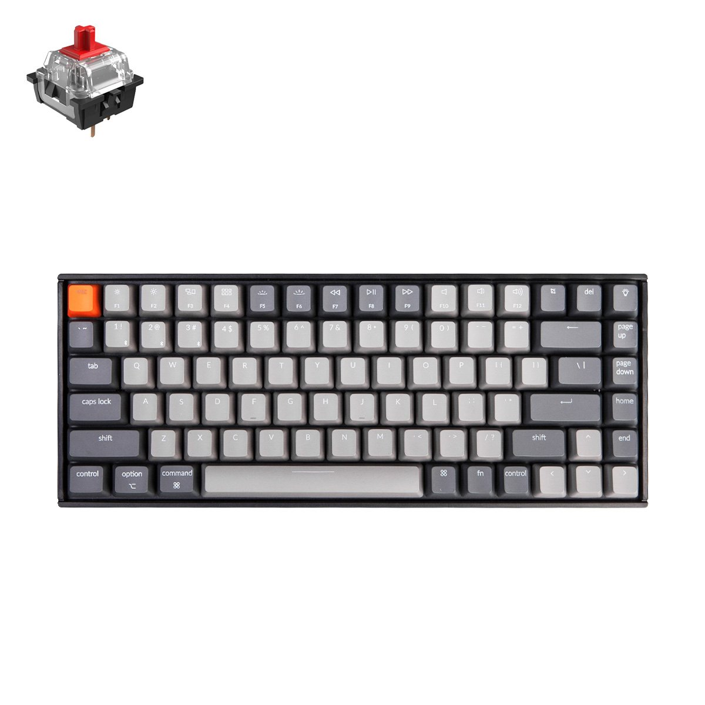

## 사용된 장비

1. 블루투스 동글

그냥 아무 동글이나 샀습니다. 어차피 국내에 유통 되는 동글들은 칩셋만 가져와서 드라이버만 만들어서 파는거라서 아무거나 쓰셔도 상관없습니다. 다만 해당 동글의 칩셋은 확인 하시길 바랍니다. 제가 산 제품은 [ZIO-K2](http://itempage3.auction.co.kr/DetailView.aspx?itemno=B749503812) 입니다.



해당 제품은 [CSR 8510 Chipset](https://www.qualcomm.com/products/csr8510) 이 내장되어 있습니다.

2. 키보드(KeyChronK2)

[Keychron 공홈](https://www.keychron.com/products/keychron-k2-mechanical-keyboard)



## 블루투스 연결 방법

### Bluetooth Service  확인

```shell
$ service bluetooth status
Redirecting to /bin/systemctl status bluetooth.service
● bluetooth.service - Bluetooth service
   Loaded: loaded (/usr/lib/systemd/system/bluetooth.service; enabled; vendor preset: enabled)
   Active: active (running) since 화 2019-12-10 18:27:25 KST; 19min ago
     Docs: man:bluetoothd(8)
 Main PID: 1442 (bluetoothd)
   Status: "Running"
    Tasks: 1
   CGroup: /system.slice/bluetooth.service
           └─1442 /usr/libexec/bluetooth/bluetoothd

12월 10 18:27:25 mgr systemd[1]: Starting Bluetooth service...
12월 10 18:27:25 mgr bluetoothd[1442]: Bluetooth daemon 5.44
12월 10 18:27:25 mgr systemd[1]: Started Bluetooth service.
12월 10 18:27:25 mgr bluetoothd[1442]: Starting SDP server
12월 10 18:27:25 mgr bluetoothd[1442]: Bluetooth management interface 1.14 initialized
12월 10 18:27:45 mgr bluetoothd[1442]: Endpoint registered: sender=:1.78 path=/Med...ce
12월 10 18:27:45 mgr bluetoothd[1442]: Endpoint registered: sender=:1.78 path=/Med...nk
Hint: Some lines were ellipsized, use -l to show in full.

```


### 블루투스 동글 설정

```shell
$ sudo $ hcitool dev 
Devices:
	hci0	00:1A:7D:DA:71:14
$ sudo bluetoothctl
[bluetoothctl] : power on
[bluetoothctl] : agent on
```


### 블루투스 KeychronK2 연결

```shell
$ sudo bluetoothctl
[bluetoothctl] : scan on
[CHG] Device DC:2C:26:D0:FB:63 RSSI is nil
[bluetoothctl] : trust DC:2C:26:D0:FB:63
[bluetoothctl] : pair DC:2C:26:D0:FB:63
[bluetoothctl] : paired-devices
Device DC:2C:26:D0:FB:63 Keychron K2
[bluetoothctl] : devices
Device DC:2C:26:D0:FB:63 Keychron K2
[bluetoothctl] : connect DC:2C:26:D0:FB:63
Attempting to connect to DC:2C:26:D0:FB:63
[CHG] Device DC:2C:26:D0:FB:63 Connected: yes
Connection successful
[CHG] Device DC:2C:26:D0:FB:63 ServicesResolved: yes
```

